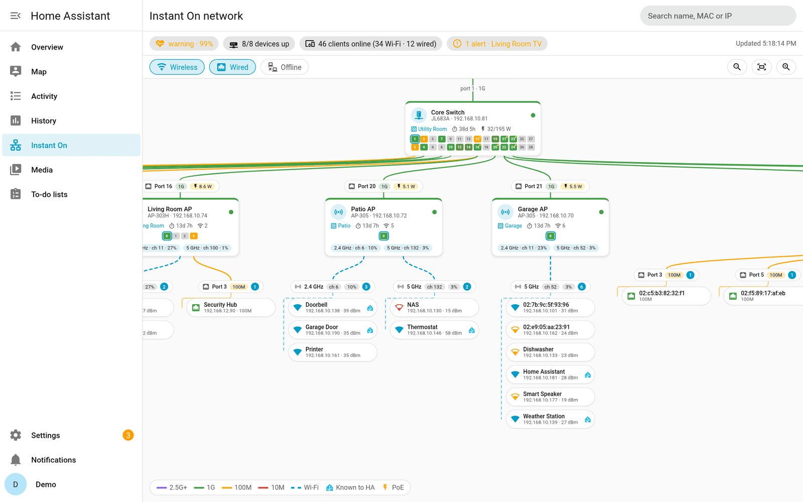
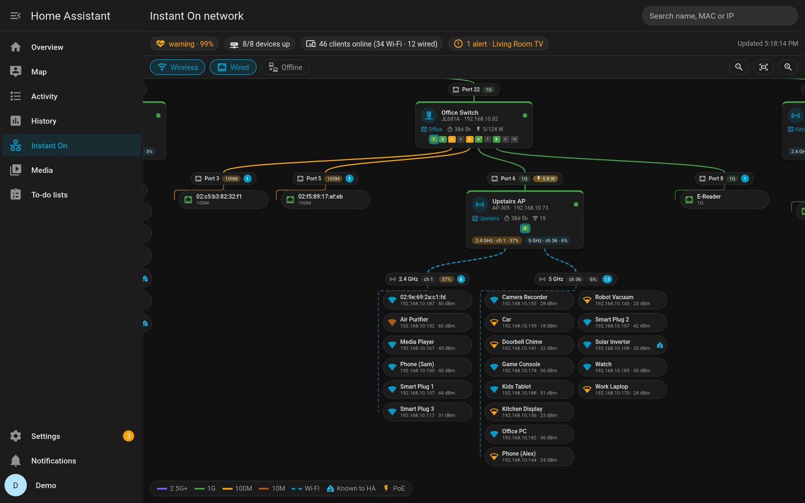
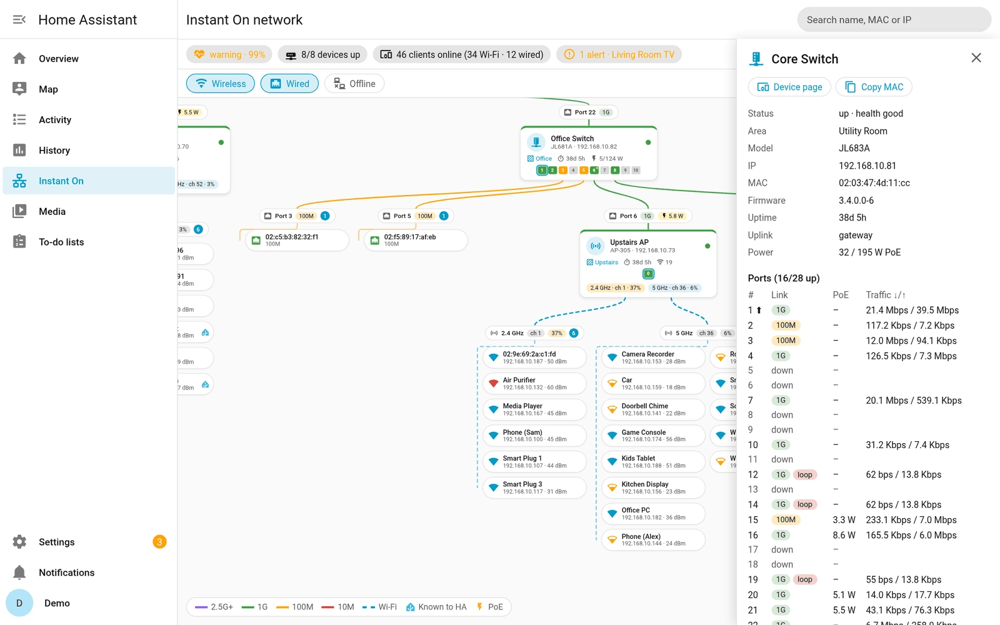
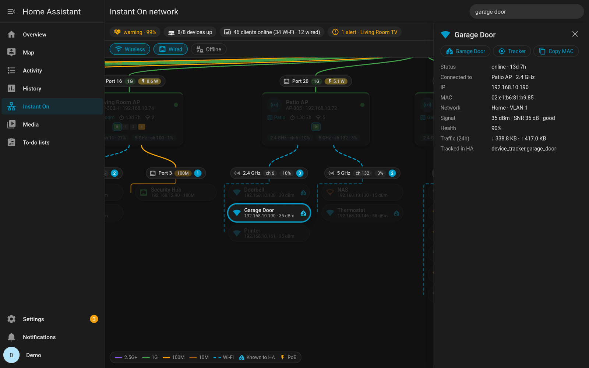
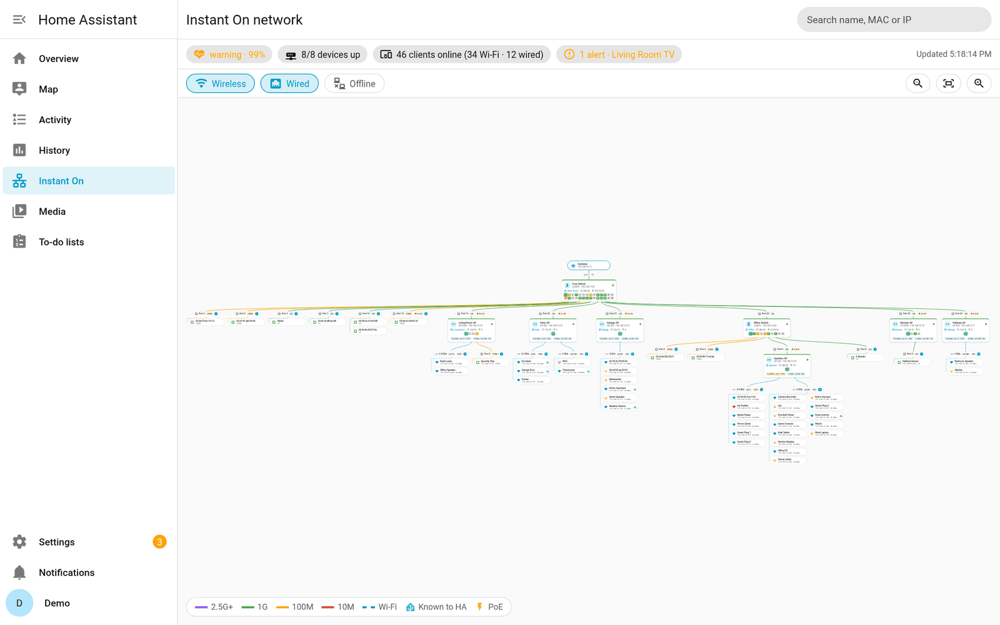
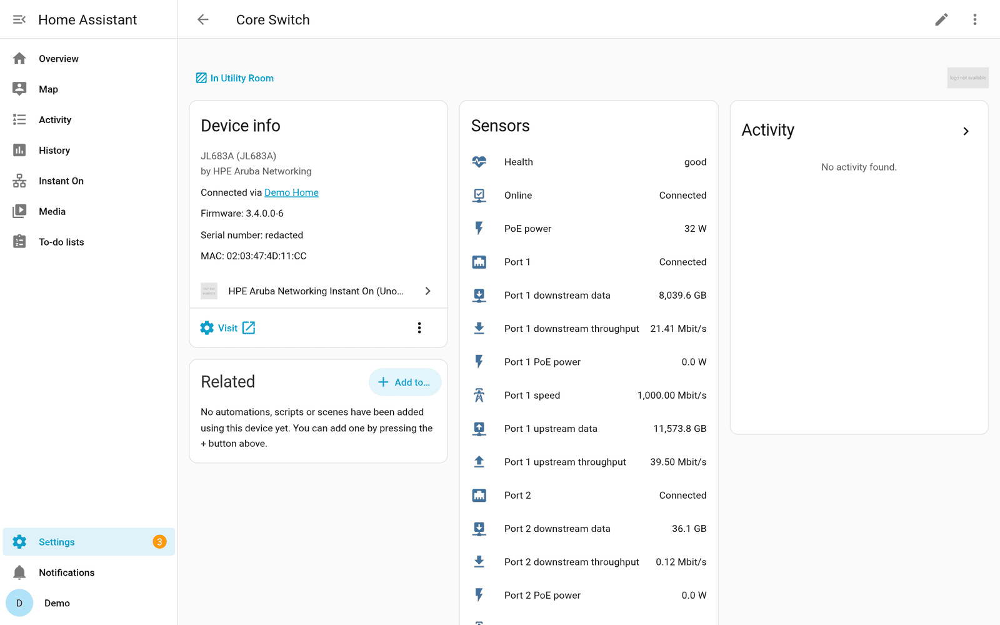
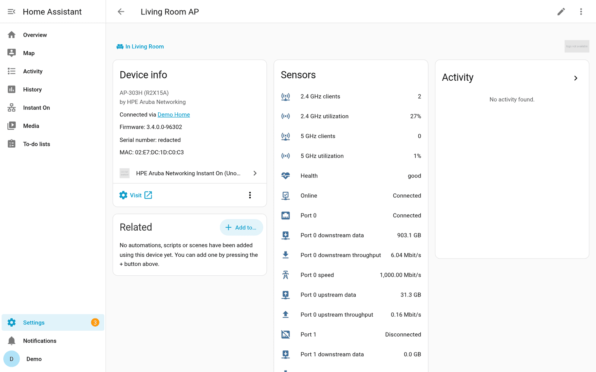
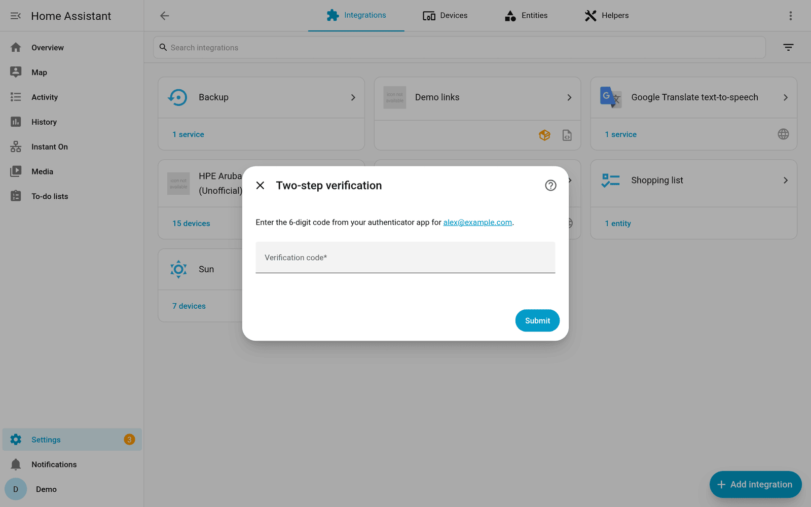
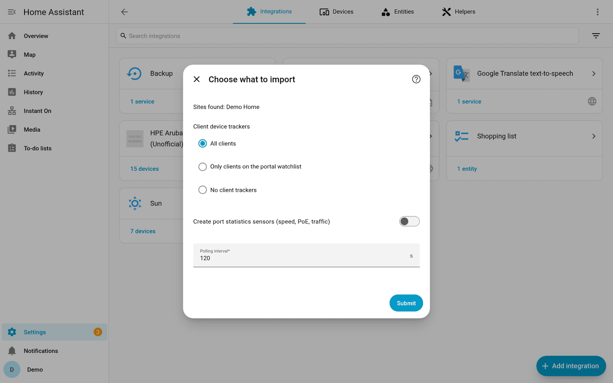

# HPE Aruba Networking Instant On for Home Assistant (unofficial)

[](https://hacs.xyz/docs/faq/custom_repositories)
[](https://github.com/scetep/HPInstantOnAPI/actions/workflows/validate.yml)

A Home Assistant integration for cloud-managed **HPE Aruba Networking Instant On**
access points and switches. It exposes site health, devices, radios, switch
ports and clients (by MAC address).

> [!IMPORTANT]
> This project is not affiliated with HPE. It uses the undocumented API behind
> the Instant On web portal (`portal.instant-on.hpe.com`), which can change
> without notice. It only **reads** data.



<details>
<summary>More screenshots</summary>

| | |
|---|---|
|  Dark theme |  Port table in the details drawer |
|  Search jumps to a client |  Whole site at a glance |
|  Switch device with port sensors |  Access point with radio sensors |
|  Two-step verification during setup |  Setup options |

Screenshots use anonymized demo data (`scripts/demo_hass.py`).
</details>

## Features

- **Network map** in the sidebar (like the Zigbee map): switches with their
  port faceplate, access points with their radios, and every client under the
  exact port or band it uses.
- **Sign-in with two-step verification (MFA).** Your password is used once and
  never stored; Home Assistant keeps a revocable session token.
- **Site:** health, health score, active alerts (with the latest alert),
  devices online, clients online (wired/wireless), throughput, data used in
  the last 24h, active networks, firmware update status.
- **Access points and switches** (one HA device each): online, health, IP,
  last boot, wired/wireless clients, PoE consumption and budget, pending
  firmware.
- **Radios:** utilization, clients, channel and transmit power per band.
- **Switch ports:** link state for every port, with speed, connected device,
  the clients on that port and PoE status as attributes. Optional sensors for
  speed, PoE watts, traffic counters and throughput.
- **Clients:** a device tracker per MAC address, with IP, SSID/VLAN, AP or
  switch port, band, signal and 24h traffic.
- **`instant_on.lookup_mac` action:** where is this MAC right now?
- **Events** for automations: `instant_on_event` (portal event log) and
  `instant_on_alert` (new alert raised).
- **Diagnostics download** with credentials, names, SSIDs, emails and
  locations removed, MACs hashed and IPs masked.

## Installation

### HACS (recommended)

1. HACS → ⋮ → **Custom repositories** → add
   `https://github.com/scetep/HPInstantOnAPI`, type **Integration**.
2. Install **HPE Aruba Networking Instant On (Unofficial)** and restart Home Assistant.
3. **Settings → Devices & services → Add integration → Instant On**.

### Manual

Copy `custom_components/instant_on` into your Home Assistant
`config/custom_components/` folder and restart.

## Configuration

1. Enter your Instant On portal email and password.
2. If two-step verification is enabled, enter the 6-digit code from your
   authenticator app.
3. Pick the sites (if you have several) and options:

| Option | Default | Description |
|---|---|---|
| Client device trackers | All clients | `all`, `watchlist` (clients on the portal watchlist) or `none` |
| Port statistics sensors | Off | Adds speed, PoE, traffic and throughput sensors for every port (about 6 per port) |
| Polling interval | 120 s (min. 60) | Devices, ports and clients. The event log refreshes every 5 minutes; site configuration and firmware every 10 minutes |

You can change these later under **Configure**.

**Recommended:** use a dedicated Instant On account with the *viewer* role and
two-step verification enabled.

### How clients link to your other devices

A client tracker has the client's MAC address. If another integration
(ESPHome, Shelly, Google Cast, …) already has a device with that MAC, the
tracker is enabled and Home Assistant shows the devices as related. Trackers
for MACs Home Assistant doesn't know yet are created **disabled**; enable the
ones you care about.

### Session tokens

- The refresh token rotates on every use and is saved to the config entry
  immediately.
- Instant On revokes the whole session if an old refresh token is replayed.
  Restoring an old HA backup, or copying the config entry to a second Home
  Assistant, therefore signs you out. Home Assistant then asks you to sign in
  again (password, plus a code if MFA is on).
- Deleting the integration revokes the token.

### API usage and rate limits

Instant On doesn't publish rate limits, so the integration keeps its traffic
low:

- About 3 requests per site per poll: roughly 2,200 a day at the default
  interval, plus about 430 for events, site configuration and token refresh.
- After a 429 or server error it doubles the wait each time (up to 15
  minutes), honors `Retry-After`, pauses the 10-minute updates, and returns
  to normal after the next successful poll.
- Each install adds up to 10% random delay to its interval, so installs
  don't poll at the same moment.
- Requests carry the header
  `User-Agent: ha-instant-on/<version> (+https://github.com/scetep/HPInstantOnAPI)`.
- It never retries your password automatically, so failed polls can't lock
  your account.

## Network map

The **Instant On** sidebar entry (admins only) opens a live map of each site:

- **Layout:** the gateway, then switches, then access points, top to bottom.
  Each switch shows its ports as a faceplate: green is 1G, amber is 100M,
  purple is 2.5G or faster, grey is down, a yellow dot means PoE and a blue
  outline marks the uplink.
- **Links:** every connected port has a lane showing speed and PoE draw, with
  the downstream device or wired clients below it. Access points fan out into
  2.4/5/6 GHz lanes with channel, utilization and wireless clients (icon
  colored by signal).
- **Home Assistant info:** a device's room is shown on its card, and a
  Home Assistant logo marks clients that another integration already knows.
- **Controls:** drag to pan, scroll or pinch to zoom, **Fit** to see
  everything. You can filter wired, wireless and offline clients, or search by
  name, MAC or IP (Enter jumps to the first match).
- **Details:** click a device or client for its details, a link to its HA
  device page, its tracker and a button to copy its MAC.

The map updates after every poll and doesn't make any extra API calls.

## Rooms and managing devices individually

Each access point and switch is its own Home Assistant device under the site,
so you can:

- assign each one to a different **area/room** (the room shows on the map);
- rename it, disable it (which disables its entities) or hide its entities;
- delete it once Instant On no longer reports it (e.g. a replaced AP).
  Devices that still exist can't be deleted; remove them in the Instant On
  portal first.

## Actions and events

```yaml
action: instant_on.lookup_mac
data:
  mac: "aa:bb:cc:dd:ee:ff"
response_variable: where
# where.connected_device, where.ports[0].port, where.ip_address, where.online, ...
```

```yaml
# Notify when a new alert is raised (e.g. a watched client went offline)
triggers:
  - trigger: event
    event_type: instant_on_alert
conditions:
  - "{{ trigger.event.data.severity in ['major', 'minor'] }}"
actions:
  - action: notify.notify
    data:
      message: >
        Instant On {{ trigger.event.data.severity }} alert:
        {{ trigger.event.data.type }} {{ trigger.event.data.client_name or '' }}
```

```yaml
# A switch port went down
triggers:
  - trigger: state
    entity_id: binary_sensor.basement_switch_port_5
    to: "off"
```

`instant_on_event` data: `site_id`, `site_name`, `event` (e.g.
`clientConnected`), `state`, `category`, `source_id`, `source_name`,
`occurred`, `attributes`.

## Limitations

- Cloud polling only; Instant On devices have no documented local API.
- Read-only: no reboots, PoE power cycling or client blocking yet.
- Tested with AP-303H/AP-305 access points and JL681A/JL683A switches.
  Gateways, stacks and mesh setups may expose data this integration doesn't
  show yet. Please open an issue with a diagnostics download.

## Command-line reports

`cli/` has a standalone script that dumps everything the API returns and
writes Markdown reports (`status.md` with Mermaid topology and charts,
`full-report.md` with all data):

```bash
pip install requests
cp .env.example .env        # INSTANTON_USER / INSTANTON_PASS (account without MFA)
python3 cli/instanton.py    # -> output/<timestamp>/ and output/latest/
python3 cli/instanton.py --json          # summary for monitoring tools
python3 cli/instanton.py --endpoint inventory
```

Wi-Fi keys and other secrets are redacted unless `--show-secrets` is given.
The exit code is 1 when the site isn't healthy, a device is down or an alert
is active. The CLI doesn't support MFA yet.

## Development

```bash
python3 -m venv .venv && . .venv/bin/activate
pip install -r requirements_test.txt ruff
pytest -q
ruff check custom_components tests scripts cli
```

To try the UI without an Instant On account, run a demo Home Assistant backed
by the fixtures (sign in with any email; the verification code is `123456`):

```bash
python3 scripts/demo_hass.py /tmp/ha-demo   # http://127.0.0.1:18124
```

Tests run against anonymized API responses in `tests/fixtures/`. To contribute
data from hardware we don't have:

```bash
python3 cli/instanton.py
python3 scripts/make_test_fixtures.py output/latest/<site-id> /tmp/my-fixtures
```

The script replaces MACs, IPs, IDs, serials, names, SSIDs, emails and
locations with fake values. Check the result before you share it.

### Releasing

1. Bump `version` in `custom_components/instant_on/manifest.json`.
2. Create a GitHub release with a matching tag (e.g. `v0.1.0`). HACS offers it
   as an update.
